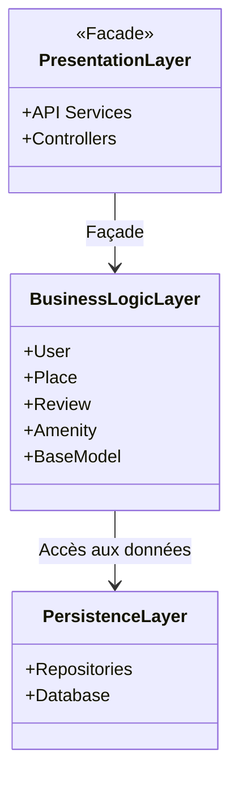
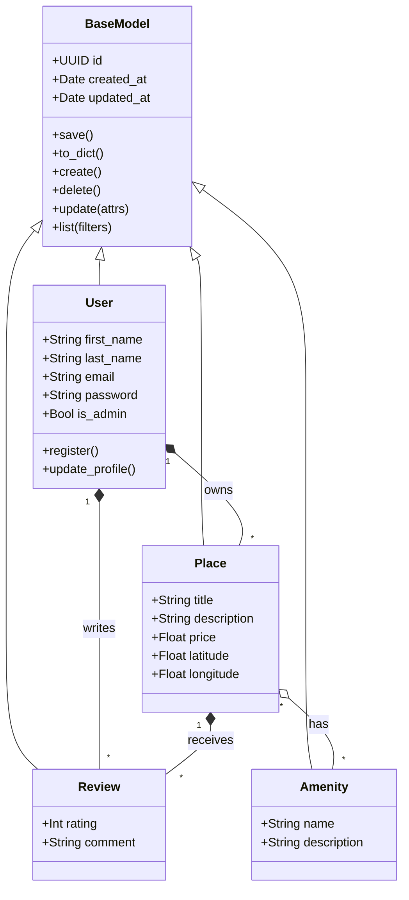
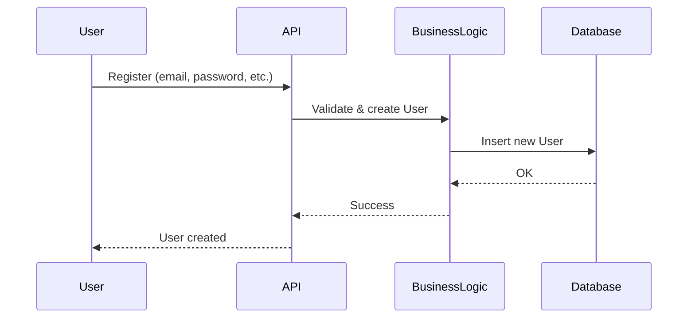
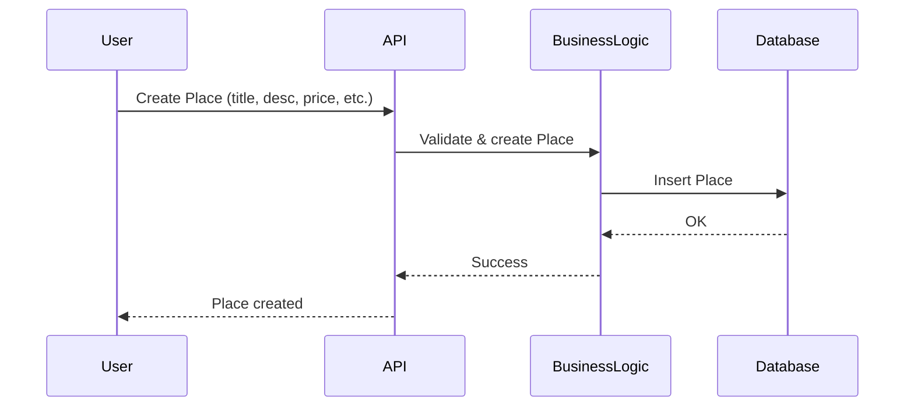
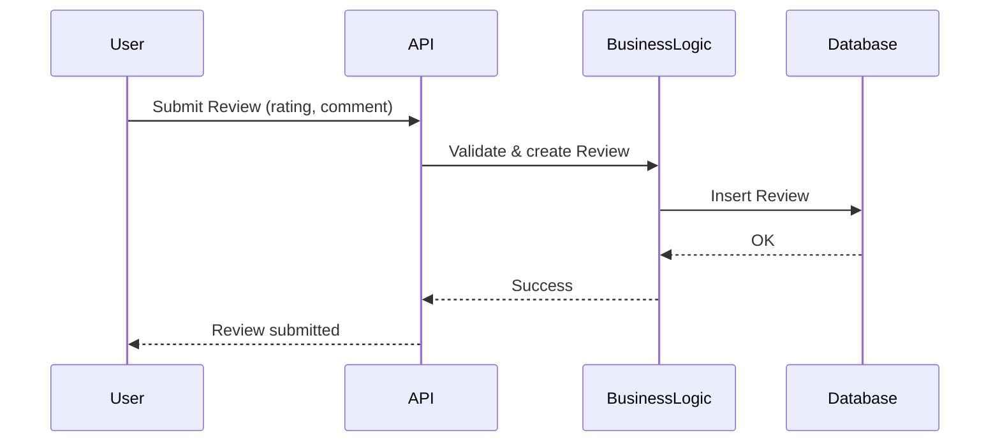
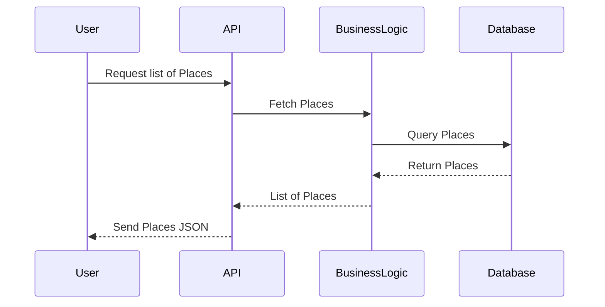

# HBNB Evolution

## Bienvenue sur le projet HBnB Evolution, une reproduction simplifiée de l'application AirBnB.

## Partie 1 : Documentation UML

*Objectif ?*
**Comprendre l'architecture de l'application, l'interaction entre les différentes classes, et l'interprétation des requêtes entre chaque couche.**

Le projet HBnB Evolution a pour but de proposer une plateforme de réservation robuste, performante et modulable.
Cette première partie rassemble toute la documentation UML nécessaire pour comprendre la structure et servir de base à l'implémentation. Chaque diagramme et description illustre les classes, leurs attributs, méthodes et relations.

---

### Diagramme de haut niveau du package

Ce diagramme met en évidence trois couches principales :

* Couche de présentation
* Couche de logique métier
* Couche de persistance

*Pourquoi ?*
La couche de présentation **interagit avec la logique métier** via une façade, simplifiant l'interaction et encapsulant la complexité.
La couche de logique métier **accède aux données** via la couche de persistance, respectant le principe de séparation des responsabilités.

---

### Diagramme de classes

Il existe cinq classes principales :

* **BaseModel** : Fournit les attributs et méthodes communs à toutes les entités.
* **User** : Représente un utilisateur du système.
* **Place** : Représente un hébergement.
* **Amenity** : Représente un équipement ou service disponible.
* **Review** : Représente un avis laissé par un utilisateur.

*Relations entre classes*

| Relation                              | Description                                                                                  |
| ------------------------------------- | -------------------------------------------------------------------------------------------- |
| `User "1" --> "*" Place : owns`       | Un utilisateur peut posséder plusieurs lieux                                                 |
| `User "1" --> "*" Review : writes`    | Un utilisateur peut écrire plusieurs avis                                                    |
| `Place "1" --> "*" Review : receives` | Un lieu peut recevoir plusieurs avis                                                         |
| `Place "*" --> "*" Amenity : has`     | Un lieu peut avoir plusieurs équipements, et un équipement peut appartenir à plusieurs lieux |

*Explication :*
Toutes les entités héritent de **BaseModel**, qui centralise les champs communs (`id`, `created_at`, `updated_at`) et les opérations CRUD (`create()`, `update()`, `delete()`, `list()`).
Cela réduit la duplication et assure une cohérence dans toutes les classes.

---

### Diagrammes de séquence

Chaque requête est traitée à travers quatre participants :

* **User** : l’utilisateur qui envoie la requête.
* **API** : l’interface qui reçoit et redirige la requête.
* **BusinessLogic** : la couche qui gère la validation et le traitement.
* **Database** : la base de données où les informations sont stockées.

**Inscription utilisateur**

**Création d’un lieu**

**Ajout d’une review**

**Récupération de la liste des lieux**

---

### Conclusion Partie 1

Le projet HBnB Evolution vise à fournir une plateforme de réservation modulaire et scalable.
Comme illustré dans les diagrammes UML, l’architecture est conçue pour rester **robuste**, **maintenable** et **extensible**.
Cette organisation assure une séparation claire entre présentation, logique métier et persistance des données, facilitant les évolutions futures.
