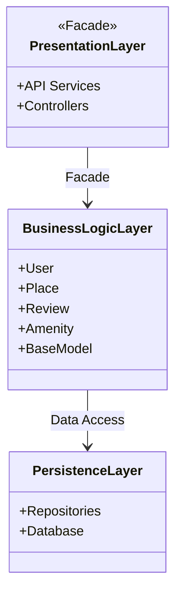
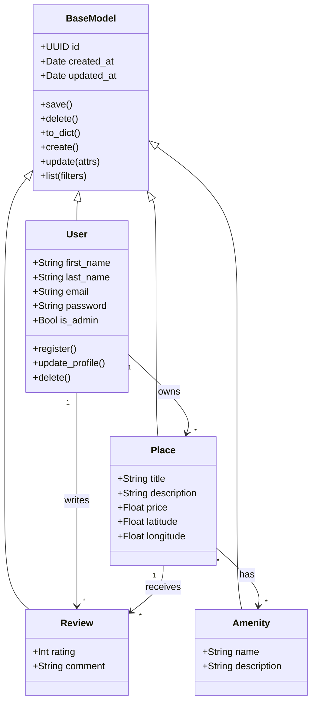
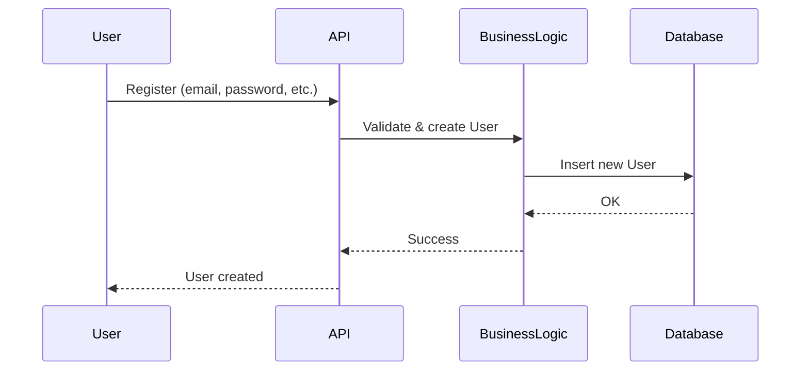
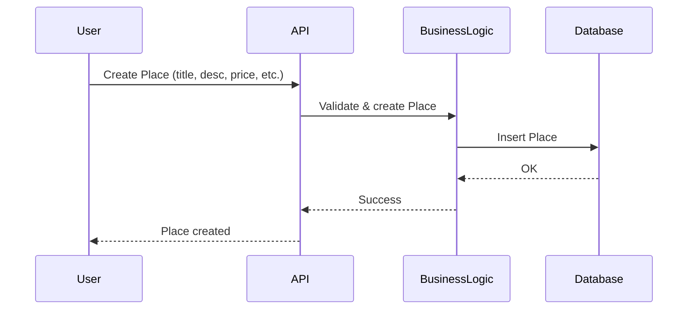
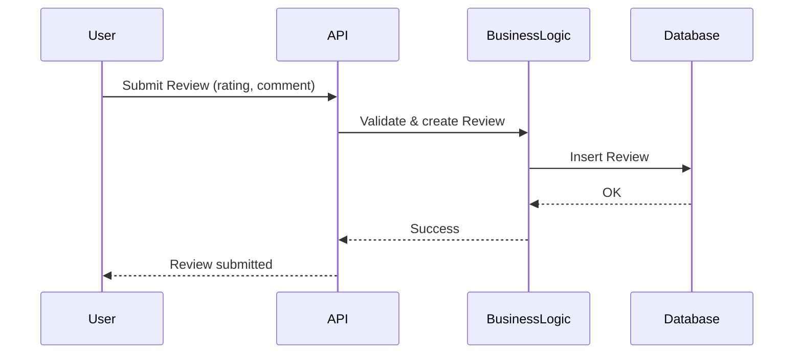
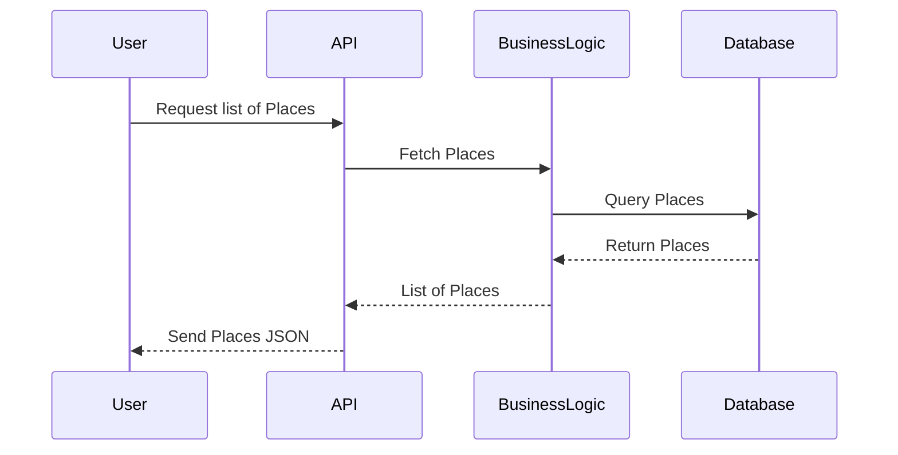

# HBNB Evolution

## Welcome to the HBnB Evolution project, a simplified AirBnB clone.

## Part 1: UML Documentation

*Objective?*
**Understand the application's architecture, the interaction between classes, and the request flow across each layer.**

The HBnB Evolution project aims to provide a robust, high-performance, and modular booking platform.
This first part gathers all UML documentation necessary to understand the structure and guide the implementation. Each diagram and description illustrates the classes, their attributes, methods, and relationships.

---

### High-Level Package Diagram

This diagram highlights three main layers:

* Presentation Layer
* Business Logic Layer
* Persistence Layer

*Why?*
The presentation layer **interacts with the business logic** via a facade, simplifying the interaction and encapsulating complexity.
The business logic layer **accesses data** via the persistence layer, following the separation of concerns principle.

---

### Class Diagram

There are five main classes:

* **BaseModel**: Provides common attributes and methods for all entities.
* **User**: Represents a system user.
* **Place**: Represents a property listing.
* **Amenity**: Represents an available service or feature.
* **Review**: Represents a review submitted by a user.

*Class Relationships*

| Relationship                          | Description                                                                              |
| ------------------------------------- | ---------------------------------------------------------------------------------------- |
| `User "1" --> "*" Place : owns`       | A user can own multiple properties                                                       |
| `User "1" --> "*" Review : writes`    | A user can write multiple reviews                                                        |
| `Place "1" --> "*" Review : receives` | A property can receive multiple reviews                                                  |
| `Place "*" --> "*" Amenity : has`     | A property can have multiple amenities, and an amenity can belong to multiple properties |

*Explanation:*
All entities inherit from **BaseModel**, which centralizes common fields (`id`, `created_at`, `updated_at`) and CRUD operations (`create()`, `update()`, `delete()`, `list()`).
This ensures consistency and reduces redundancy across all classes.

---

### Sequence Diagrams

Each request is handled by four participants:

* **User**: the client sending the request.
* **API**: the interface receiving and routing the request.
* **BusinessLogic**: the layer handling validation and processing.
* **Database**: the storage for application data.

**User Registration**

**Place Creation**

**Review Submission**

**Fetching a List of Places**

---

### Part 1 Conclusion

The HBnB Evolution project aims to provide a modular and scalable booking platform.
As illustrated by the UML diagrams, the architecture is designed to remain **robust**, **maintainable**, and **extensible**.
This structure ensures a clear separation between presentation, business logic, and data persistence, facilitating future development and scalability.
