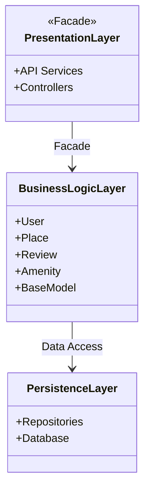
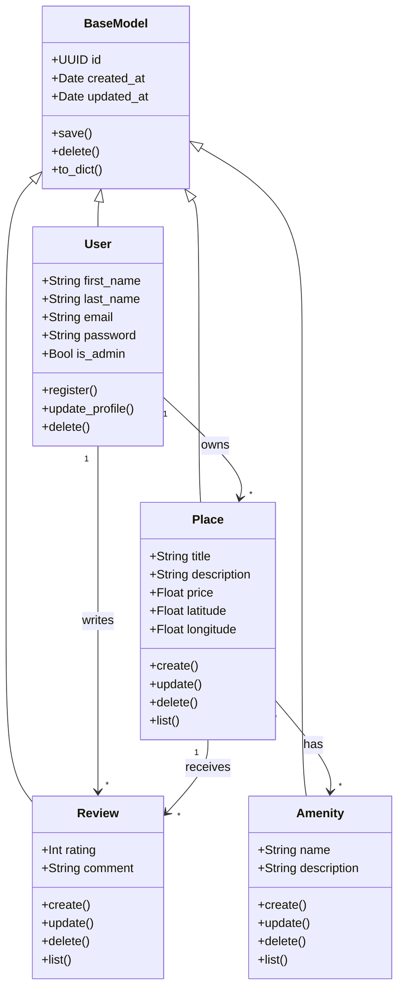
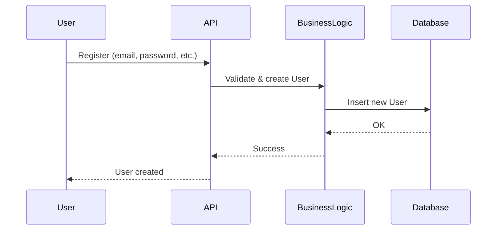
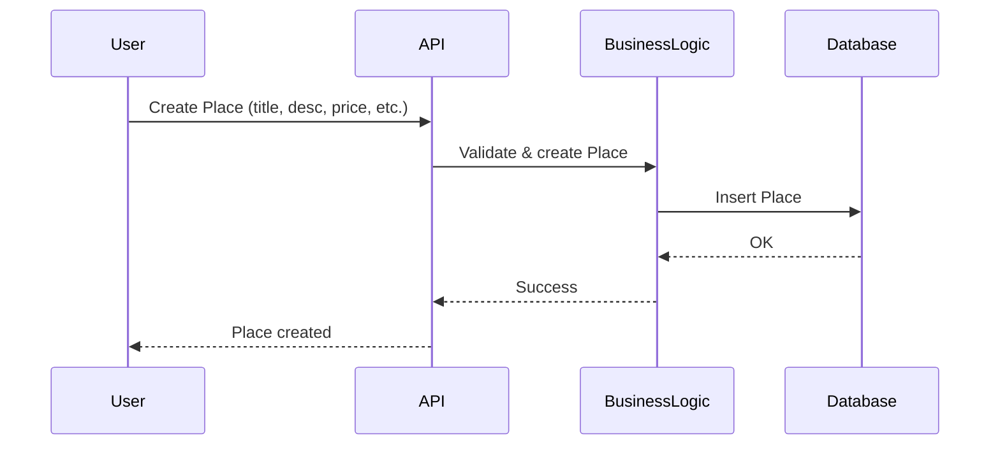
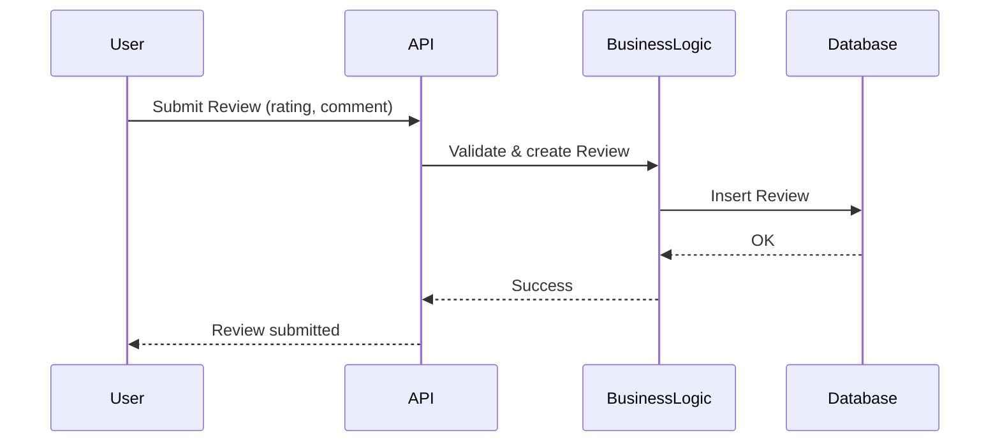
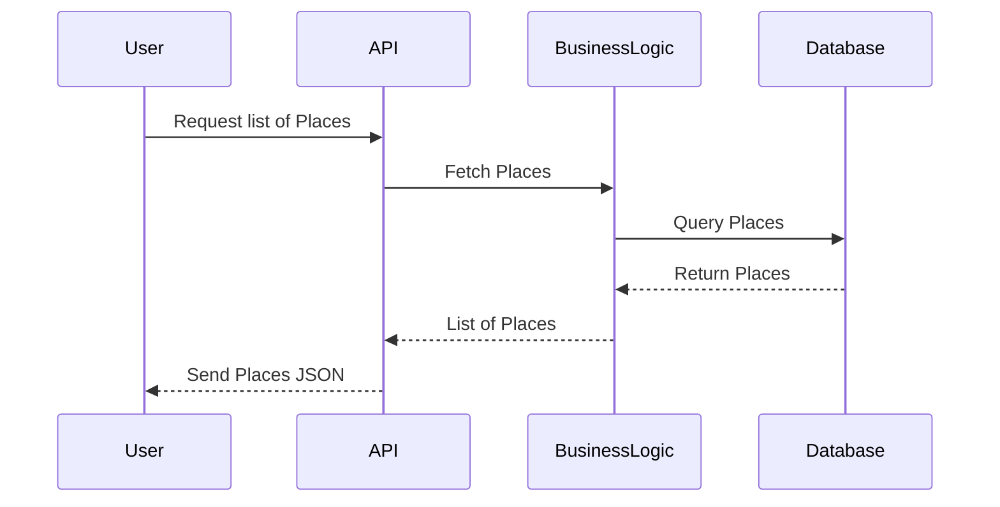

# HBNB Evolution
## Welcome to the HBnB Evolution project — a simplified reproduction of the AirBnB platform.

## Part 1: UML Documentation
*Goal?*  
**Understand the application's architecture, the interactions between classes, and how requests flow across layers.**

The HBnB Evolution project aims to deliver a robust, efficient, and scalable booking platform.  
This first part gathers all UML documentation necessary to understand the system’s design and serve as a foundation for implementation. Each diagram and description illustrates the structure, attributes, methods, and relationships in detail.

---
### High-Level Package Diagram
This diagram highlights three main layers:
- Presentation Layer
- Business Logic Layer
- Persistence Layer

*Why?*  
The presentation layer **interacts with the business logic** through a façade, simplifying interaction and encapsulating complexity.  
The business logic layer **accesses data** through the persistence layer, following the principle of separation of concerns.

---
### Class Diagram
There are five main classes:
- **BaseModel**: Provides shared attributes and methods for all entities.
- **User**: Represents a system user.
- **Place**: Represents an accommodation.
- **Amenity**: Represents an available service or feature.
- **Review**: Represents feedback left by a user.

*Relationships between classes*

| Relation | Description |
| ----------- | ----------- |
| `User "1" --> "*" Place : owns` | A user can own several places |
| `User "1" --> "*" Review : writes` | A user can write multiple reviews |
| `Place "1" --> "*" Review : receives` | A place can receive several reviews |  
| `Place "*" --> "*" Amenity : has` | A place can have several amenities, and an amenity can belong to multiple places |

*Explanation:*  
All main entities inherit from **BaseModel**, which standardizes common fields (`id`, `created_at`, `updated_at`) and operations (`save()`, `delete()`, `to_dict()`). This inheritance promotes code reuse and simplifies maintenance.

---
### Sequence Diagrams
Each request is handled across four main participants:
- **User**: The client sending a request.
- **API**: The interface receiving and routing client requests.
- **BusinessLogic**: The layer managing validation and processing rules.
- **Database**: The persistence layer where data is stored.

Below are four key use cases illustrated as sequence diagrams.

**User Registration**

**Create a New Place**

**Add a Review**

**Retrieve a List of Places**

---
### Conclusion — Part 1
The HBnB Evolution project aims to provide a modular and scalable booking platform.  
As demonstrated in the UML documentation, the architecture is designed to remain **robust**, **maintainable**, and **easily extendable**.  
This foundation ensures a clear separation of concerns between presentation, business logic, and data persistence layers — supporting long-term scalability and future integration with additional services.
