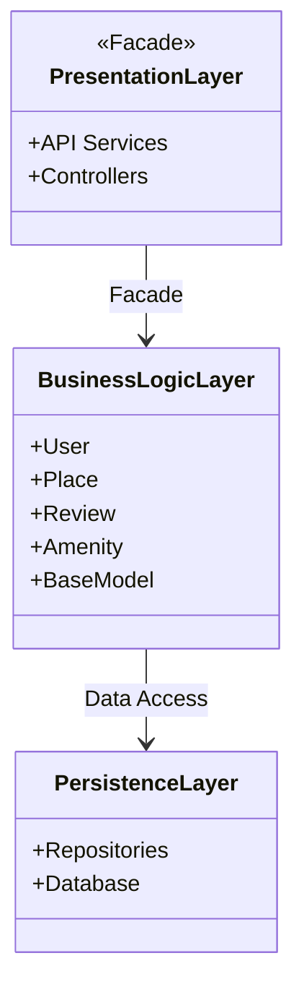
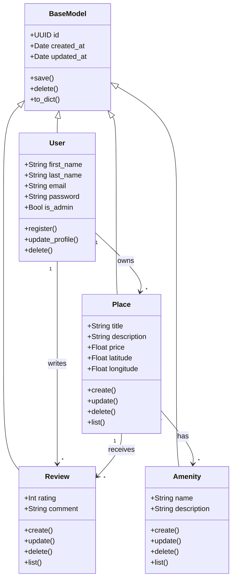
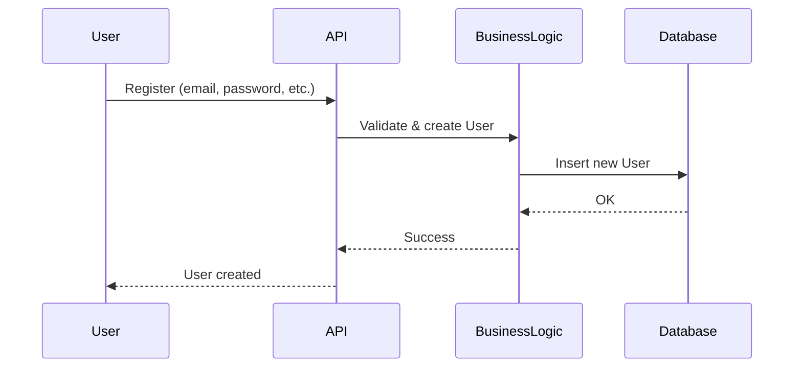
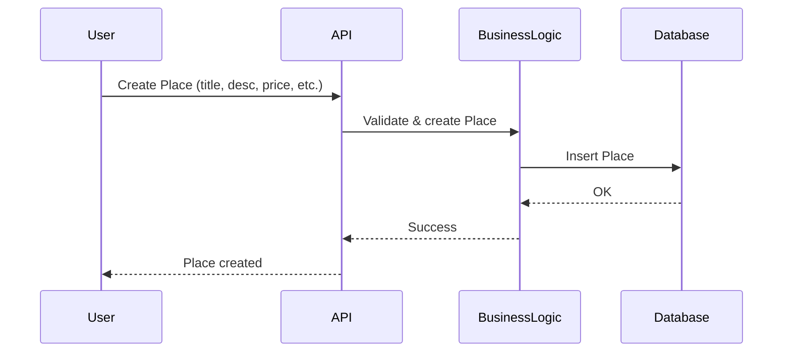
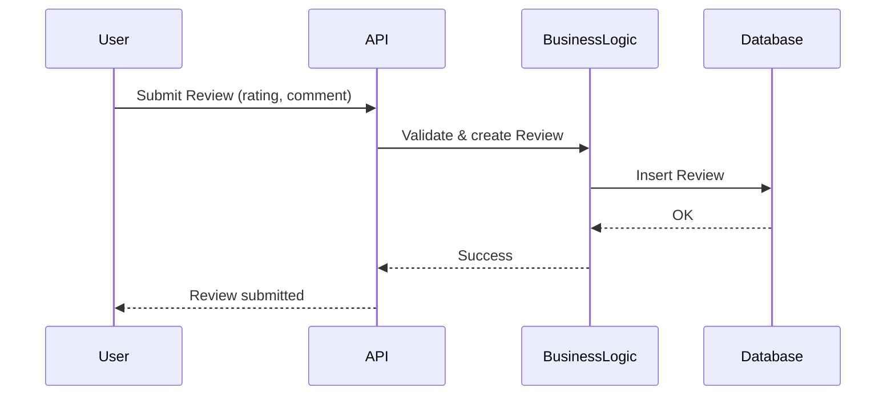
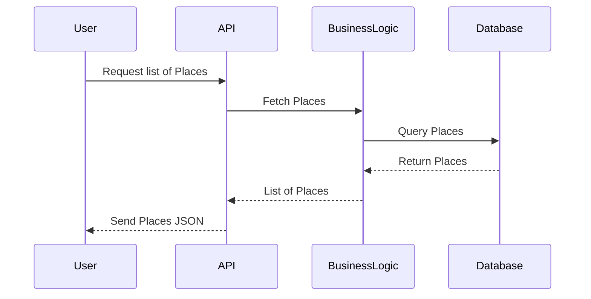

# HBNB Evolution
## Bienvenue sur le projet HBnB Evolution, une reproduction simplifiée de l'application AirBnB.

## Partie 1 : Documentation UML
*Objectif ?*  
**Comprendre l'architecture de l'application, l'interaction entre les différentes classes, et l'interprétation des requêtes entre chaque couche.**

Le projet HBnB Evolution a pour but de proposer une plateforme de réservation robuste, performante et efficace.  
Cette première partie rassemble toute la documentation nécessaire au développement et à la compréhension de l'architecture de l'application.  
Chaque document présenté ici illustre en détail toutes les classes, leurs attributs, leurs méthodes et les interactions entre les couches.

---

### Diagramme de haut niveau du package
Ce diagramme illustre les trois couches principales :
- **Couche de présentation** (API, services)
- **Couche de logique métier** (modèles, règles de gestion)
- **Couche de persistance** (accès et stockage des données)

*Pourquoi ?*  
La couche de présentation **utilise la logique métier** via une façade, ce qui simplifie l'interaction et encapsule la complexité.  
La logique métier **accède aux données** via la couche de persistance, en respectant le principe de séparation des responsabilités.

> Ce diagramme montre l'organisation générale du système en trois couches distinctes, interconnectées à travers le pattern **Facade**.  
> Chaque couche a une responsabilité claire : présentation, logique métier et persistance des données.

---

### Diagramme de classes
La couche de logique métier repose sur une hiérarchie d'objets organisée autour d’une classe de base commune `BaseModel`.

#### Les classes principales :
- **BaseModel** : Classe mère contenant les attributs et méthodes communs à toutes les entités.
- **User** : Représente un utilisateur du système.
- **Place** : Représente un hébergement créé par un utilisateur.
- **Amenity** : Représente un équipement ou service disponible dans un lieu.
- **Review** : Représente un avis laissé par un utilisateur sur un lieu.

#### Relations entre classes
| Relation | Description |
| ----------- | ----------- |
| `BaseModel <|-- User` | Toutes les entités héritent de BaseModel |
| `BaseModel <|-- Place` | 〃 |
| `BaseModel <|-- Review` | 〃 |
| `BaseModel <|-- Amenity` | 〃 |
| `User "1" --> "*" Place : owns` | Un utilisateur peut posséder plusieurs lieux |
| `User "1" --> "*" Review : writes` | Un utilisateur peut écrire plusieurs avis |
| `Place "1" --> "*" Review : receives` | Un lieu peut recevoir plusieurs avis |
| `Place "*" --> "*" Amenity : has` | Un lieu peut avoir plusieurs équipements, et un équipement peut appartenir à plusieurs lieux |

> Ce diagramme met en avant l’héritage de la classe `BaseModel`, qui centralise les méthodes de persistance et les métadonnées de chaque entité.  
> Cela assure une structure cohérente et facilite l’évolution du modèle de données.

---

### Diagrammes de séquence
Chaque requête est gérée à travers quatre participants :
- **User** : L'utilisateur client qui envoie une requête.
- **API** : L'interface qui reçoit la requête.
- **BusinessLogic** : La couche de logique métier (incluant `BaseModel`).
- **Database** : La base de données où les informations sont stockées.

#### Exemple 1 — Inscription utilisateur

#### Exemple 2 — Création d'un nouveau lieu

#### Exemple 3 — Ajout d'une review

#### Exemple 4 — Récupération de la liste des lieux

> Ces diagrammes de séquence illustrent clairement la communication entre les couches, depuis la requête de l'utilisateur jusqu'à la réponse.  
> La cohérence entre les interactions garantit une architecture propre et facilement testable.

---

### Conclusion Partie 1
Le projet HBnB Evolution a pour objectif de proposer une plateforme de réservation.  
Comme observé dans les documents de cette partie, l'architecture est pensée pour être **robuste**, **performante** et **modulable**, respectant les principes de la programmation orientée objet et de la séparation des responsabilités.

---
