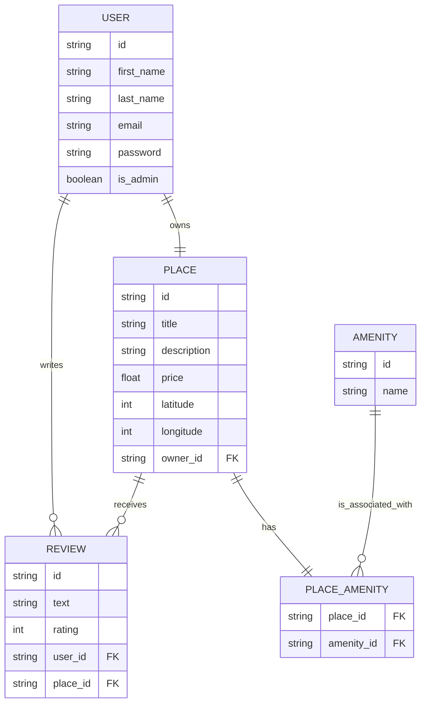

```mermaid
erDiagram
    USER ||--|| PLACE : owns
    USER ||--o{ REVIEW : writes
    PLACE ||--o{ REVIEW : receives
    PLACE ||--|| PLACE_AMENITY : has
    AMENITY ||--o{ PLACE_AMENITY : is_associated_with
    USER {
        string id
        string first_name
        string last_name
        string email
        string password
        boolean is_admin
    }
    PLACE {
        string id
        string title
        string description
        float price
        int latitude
        int longitude
        string owner_id FK
    }
    REVIEW {
        string id
        string text
        int rating
        string user_id FK
        string place_id FK
    }
    AMENITY {
        string id
        string name
    }
    PLACE_AMENITY {
        string place_id FK
        string amenity_id FK
    }
```